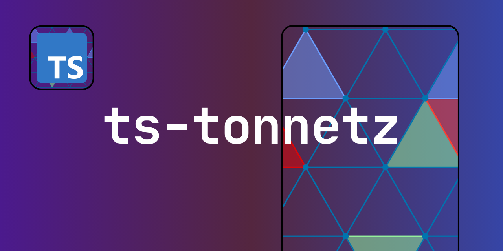

<h1 align="center"> TS-Tonnetz </h1>

**TS-Tonnetz** is a library of transformations, graphs, and cycles from *Mathematical Music Theory*, enabling the creation, manipulation, and analysis of musical structures across various Tonnetz spaces.

<p align="center">
  
  
  
  
</p>



## Currently Integrated in [**Topos**](https://topos.live/#ziffers_tonnetz)

TS-Tonnetz is now **integrated into the [**Topos live coding environment**](https://topos.live/#ziffers_tonnetz)**, where you can try it out and explore its features directly.

##  Suite of Tonnetz Tools with Academic Grounding

It emerged as a development branch in late 2023 to contribute to Miika Alonen's phenomenal [**ZifferJS**](https://github.com/amiika/zifferjs) project.

Backed by *two doctoral theses* and additional *research articles*, TS-Tonnetz offers a powerful set of tools for exploring musical operations within various Tonnetz spaces. Its focus is on the application of these tools for **algorithmic composition** and **live coding**, rather than musicological analysis.

## Installation

```node
npm i ts-tonnetz
```

## Features Implemented

Transformations follow the edge flip between triangles and their geometries (so far), maintaining two common notes (not necessarily considering voice-leading). In other words, different Tonnetz spaces adhere to the voice-leading space geometry of the conventional Tonnetz.

- [x] PRL functions and compositions of any length
- [x] Film music transformations: `f(), n(), s(), h(), t6()`
- [x] Cardinal transformations
- [x] Cube Dance
- [x] OctaTowers
- [x] Power Towers
- [x] Weitzmann Regions, Boretz Regions
- [x] HexaCycles, OctaCycles, EnneaCycles
- [x] Hamiltonian Cycles

Mathematical inspiration (`Trajectoires`) in the Doctoral thesis written by [**Louis Bigo**](https://theses.hal.science/tel-01326827):

```text
Représentations symboliques musicales et calcul spatial (2013).
```

## Dual Geometry of the Tonnetz

We have implemented all the Neo-Riemannian functions developed in the Doctoral thesis written by [**Sonia Cannas**](https://publication-theses.unistra.fr/public/theses_doctorat/2018/CANNAS_Sonia_2018_ED269.pdf):

```text
Geometric Representation and Algebraic Formalization of Musical Structures (2018).
```

Each of these new transformations from the generalized transformational theory for seventh chords is enabled for the Tonnetz you want to explore.

### PLRQ-group

- [x] `p12, p14, p23, p35`
- [x] `r12, r23, r42, r35, r53`
- [x] `l13, l15, l42`
- [x] `q43, q15, rr35, qq51, n51`

### PLRQ-group extended

Includes more types of seventh chords and their transformations between them.

- [x] `p18, p19, p26, p39, p47, p64, p87, p98`
- [x] `r63, r76, r86, l71, l89, q62, q76`
- [x] `rr19, rr39, rr98, qq38, qq98`

### PLR*-group

Transformations with augmented and diminished triads.

- [x] `p, r, l, p32, p41, lt13, l41, l14, rt23, rt42, q13, q42, n42`

### ST-group

Transformations between triad chords and different types of seventh chords. The groups `PLRQ` and `PLR*` must be included.

- [x]  `p1M, l1d, p2m, r2M, p3d, r3m, p4M, l4m, p5d, r5d, rr5d, z5d`

Mathematical inspiration in [**the paper**](https://hal.science/hal-02021946/):

```text
A Generalized Dual of the Tonnetz for Seventh Chords:
Mathematical, Computational and Compositional Aspects
(Sonia Cannas and Moreno Andreatta, 2018).
```
### Extensions of the Axis System in Béla Bartók

Generalized implementation on any Tonnetz of the harmonic groups of **axis system** ideaded by [**Ernő Lendvai**](https://web.archive.org/web/20150614031849/http://www.harmonicwheel.com/bartok_axes.pdf): Tonic (8 chords), Subdominant (8 chords), and Dominant (8 chords). The parameters specify two directions, sought emotion (based on the ideas of [**Mauro de Maria**](https://www.youtube.com/watch?v=EhmbTaEKUZo)), cross or diagonal movement. Major-minor and minor-major alternation available for cross path.

The manipulation can be done using a single function:
* `genCardinalPoints()`

Groups with chord roots separated by major thirds (which we will call triangular) are also added.
* `genTriangularPoints()`

We added **six new graphs** generalized inspired by the idea of cardinal points (extension of the axial system) for film music by Mauro de Maria. These graphs link the groups of cardinal points with the groups of three chords.

Each graph can be manipulated from a single function:
* `genCardinalTriangularGraph()`

## Contributing

- New features (`feat: <...>` )
- Fix errors and bugs (`fix: <...>`)
- Refactor (`refactor: <...>`)
- Testing (`test: <...>`)
- Documentation (`docs: <...>`)

## License

[MIT License](https://github.com/edelveart/TypeScriptTonnetz/blob/main/LICENSE)
